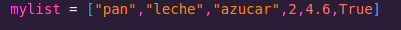
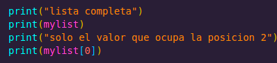
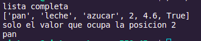
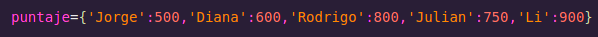
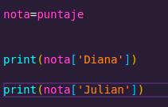
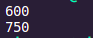
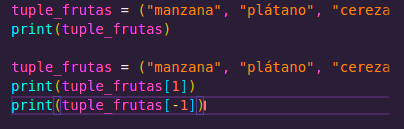

# LISTA
#
### Una lista en Python es una estructura de datos formada por una secuencia ordenada de objetos, que no tienen por qué ser del mismo tipo.
#

#
### Para poder ver la lista creada o un elemento en concreto de la lista, podemos usar el índice, siempre conociendo que el primer elemento de la lista ocupa la posición 0.
#

#

#
# DICCIONARIO
#
### Los diccionarios en Python nos permiten almacenar una serie de mapeos entre dos conjuntos de elementos, llamados keys and values (Claves y Valores)
# 

#

#
### Despues de terminar de escribir la estrucuctura al ejecutarlo nos debe salir el codigo
#

#
# TUPLAS
#
### #las tuplas son un tipo de secuencia inmutable. Esto quiere decir que una tupla no puede ser modificada (no se pueden añadir ni eliminar elementos a una tupla)
#
